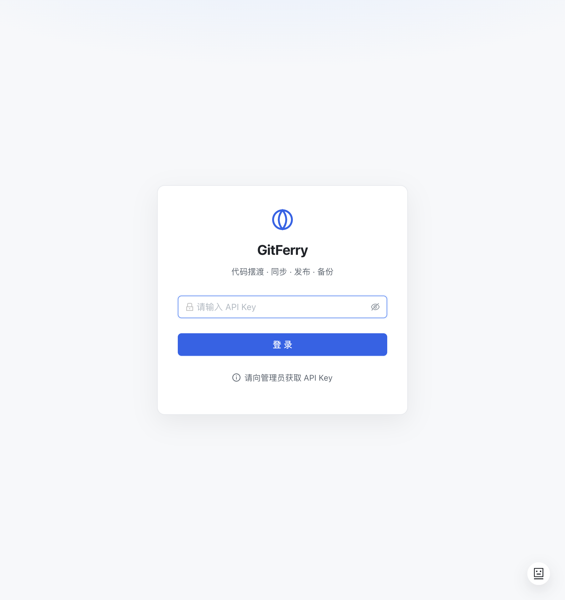
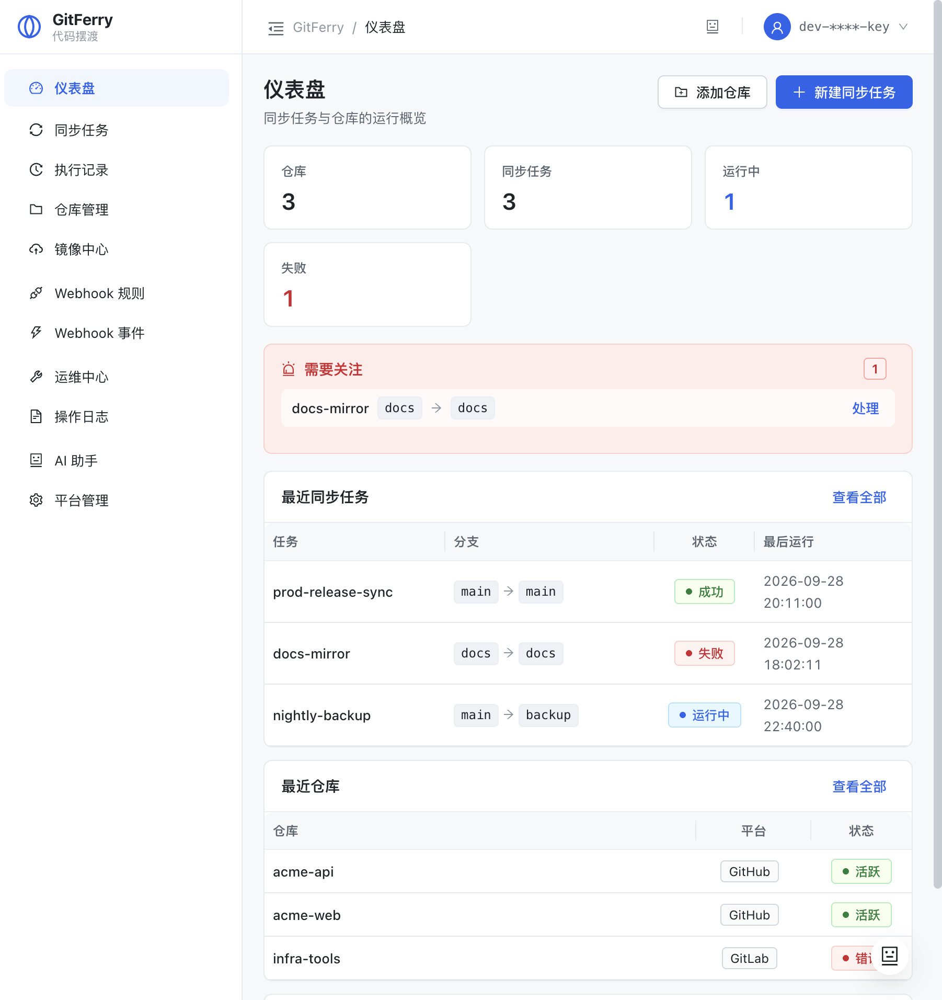
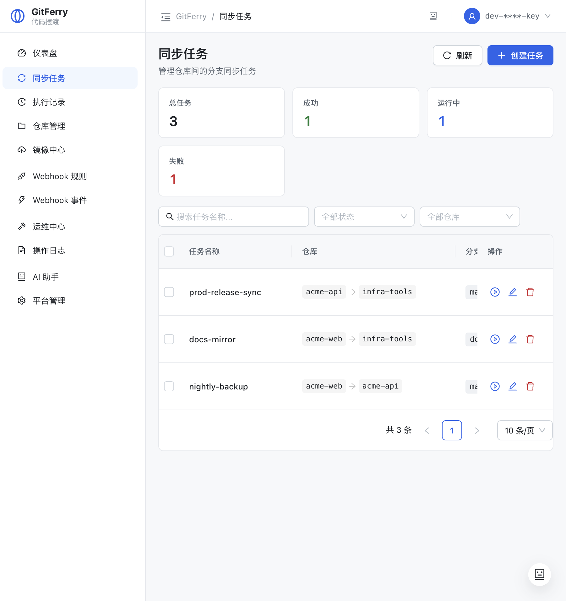
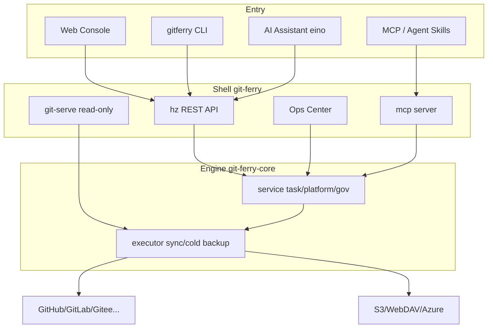

# GitFerry

> Chinese name 「摆渡」— ferry your code where it belongs: between intranets, out to the open-source world, and into backup harbors.

[](https://github.com/yi-nology/git-ferry/actions/workflows/ci.yml)
[](https://github.com/yi-nology/git-ferry/actions/workflows/release.yml)
[](https://goreportcard.com/report/github.com/yi-nology/git-ferry)
[](https://go.dev/)
[](LICENSE)
[](https://github.com/yi-nology/git-ferry/releases)
[](https://www.npmjs.com/package/gitferry-cli)

**[中文文档](./README.zh-CN.md)**

[Why GitFerry](#why-gitferry) · [Capabilities](#capabilities) · [Install CLI](#install-the-cli-humans) · [Quick Start](#quick-start-humans) · [AI Agent Quick Start](#quick-start-ai-agent) · [Web Console](#web-console) · [Ops & DR](#ops--disaster-recovery) · [Agent Access](#agent-access-cli--mcp--skills) · [Configuration](#configuration)

---

## Why GitFerry

Code hosting is fragmented: GitHub on the public internet, GitLab/Gitee on the intranet, backups scattered across scripts. The moment you need **cross-platform sync**, **open-source publishing**, and **cold backup / DR**, you end up gluing three tools together.

GitFerry folds those three jobs into one self-hosted hub:

| Scenario | Pain | GitFerry |
|----------|------|----------|
| Cross-platform sync | Scripts + cron + manual reconciliation | Task-based sync: cron / webhook / manual, with auto-compensation |
| Open-source publish | Module path rewrite, dual-repo identity clashes | Mirror hub: identity-rewrite snapshots + pre-check / build gate / divergence confirm |
| Repo backup | Git objects only; metadata lost | Cold backup (bundle/zip) + issues/PR/releases snapshots that are **restorable** |
| Ops & audit | Black box, no health signal | Health score / RPO / drift / audit hash chain / DR drills |
| Automation | Web UI only | CLI + MCP + Agent Skills — humans *and* agents |

Borrowing mature patterns from [gickup](https://github.com/cooperspencer/gickup), [ghorg](https://github.com/gabrie30/ghorg), [gitea-mirror](https://github.com/RayLabsHQ/gitea-mirror), and [github-backup-rust](https://tomtom215.github.io/github-backup-rust/), then adding three differentiators: **restorable metadata**, **Agent-Native access**, and **module identity rewrite**.

## Capabilities

### Sync

- Platforms: GitHub / GitLab / Gitee / GitLink / Gitea / self-hosted
- Triggers: cron, real-time webhook, manual / batch
- Scope: branch globs, **include allow-list**, **ignore `refs/pull/*` and other PR refs**, tags, wiki, submodules, partial clone
- Safety: `force_push_policy` (allow / block / backup_on_demand), keep_divergent, prune
- Resilience: `runwatch` auto-retry; exponential backoff on 403/429 rate limits

### Mirror & backup

- **Mirror hub**: open-source publishing (dual/multi-repo module identity rewrite snapshots)
- **Cold backup**: git bundle or **zip**, `backup_keep` rotation, optional AES-256-GCM
- **Multi-destination**: S3 / WebDAV / Azure / local fan-out
- **Metadata snapshot**: issues (with comments) / PRs / labels / milestones / releases / gists / release assets
- **Metadata restore**: `metadata-restore`, dry-run by default, selective `kinds`
- **Integrity**: Merkle root manifest + verify; DR drill (restore + fsck + refs compare)
- **Git Smart HTTP**: `git clone` cold backups over LAN without pushing to another forge first

### Organization & ecosystem

- **Org mapping**: `preserve` / `single` / `flat` / `mixed` bulk mapping to a target namespace
- **Starred import**, **public org anonymous mirror** (GitHub)
- **force-push approval flow**: pending requests under `block` policy, one-shot Admin approve
- **post-exec hook**: callback script after every sync (notify / alert / custom pipeline)

### Ops & governance

- Five-dimension health score (reliability / freshness / schedule / safety / completeness)
- Inventory (orphan repos), RPO/RTO, drift detection, unified todo queue
- RBAC (admin/operator/readonly), OIDC JWT, audit export + hash chain, legal_hold
- Prometheus metrics, ntfy/gotify/webhook notifications, success/fail heartbeats

### Interfaces

- Vue 3 web console (GitHub Enterprise / Linear-style calm ops UI)
- RESTful API + OpenAPI (`/swagger`)
- `gitferry` CLI (Envelope output, confirmation gate for dangerous ops)
- **MCP Server** (Streamable HTTP, same tool registry as the AI assistant)
- Agent Skills (Claude Code / MiMo / Cursor)
- AI ops assistant (eino, off by default)

---

## Quick Start

### Prerequisites

- Node.js 14+ (`npm`/`npx`) — only for npm install
- Platforms: macOS, Linux, Windows (x64/arm64)
- Go 1.26+ — source builds only
- Server runs standalone: Docker or Release binary

### Install the CLI (humans)

> **AI assistants:** if you are helping a user install, jump to [Quick Start (AI Agent)](#quick-start-ai-agent).

**Option 1 — npm (recommended, same UX as [gitlink-cli](https://github.com/ccfos/gitlink-cli)):**

```bash
# 1) Install CLI (postinstall downloads the right platform binary)
npm install -g gitferry-cli

# 2) Install Agent Skills (optional; for Claude Code / MiMo)
gitferry-install-skills
# or: npx skills add ./skills -y -g
```

**Option 2 — Release binary:**

```bash
# Pick a platform asset on https://github.com/yi-nology/git-ferry/releases/latest
VER=1.20.1   # replace with the latest version
curl -fsSL -o gitferry.tgz \
  "https://github.com/yi-nology/git-ferry/releases/download/v${VER}/gitferry_${VER}_darwin_arm64.tar.gz"
tar -xzf gitferry.tgz && sudo mv gitferry /usr/local/bin/
```

**Option 3 — Source build / package managers / Docker:**

```bash
git clone https://github.com/yi-nology/git-ferry.git
cd git-ferry
make build && make build-cli    # output/git-ferry + output/gitferry
make docker-build               # server image

# Package manager templates: examples/packaging/
# brew install yi-nology/tap/git-ferry   (after tap publish)
```

### Quick Start (humans)

```bash
# 1. Configure CLI (writes ~/.config/gitferry/config.yaml)
gitferry config init --base-url http://127.0.0.1:8890 --token <API_KEY>
# or via env:
export GITFERRY_BASE_URL=http://127.0.0.1:8890
export GITFERRY_TOKEN=<API_KEY>

# 2. Verify connectivity
gitferry auth status
gitferry task +list --format json

# 3. Start the server (if not running)
cp .env.example .env && openssl rand -base64 32   # set ENCRYPTION_KEY
cp conf/config.example.yaml conf/config.yaml && make run
# Open http://localhost:8890  (System → CLI / Agent has the command cheatsheet)
```

### Quick Start (AI Agent)

> Steps for Claude Code / MiMo / Cursor. The user must supply an API Key in the browser or CI.

**Step 1 — Install**

```bash
npm install -g gitferry-cli
gitferry-install-skills
```

**Step 2 — Configure**

```bash
gitferry config init --base-url http://127.0.0.1:8890 --token "$GITFERRY_TOKEN"
# or env only (CI / sandbox):
export GITFERRY_BASE_URL=http://127.0.0.1:8890
export GITFERRY_TOKEN=<API_KEY>
```

**Step 3 — Verify**

```bash
gitferry auth status
gitferry ops +todo --format json
```

API Key source: the server `GIT_SYNC_API_KEY` used by the web console, or the key bound to the signed-in session.

### First sync in 3 minutes

1. **Platforms** → add GitHub/GitLab credentials → test connection  
2. **Repos** → add source and target (or `POST /ops/auto-discover`)  
3. **Sync tasks** → create a task (cron / include_branches / force_push_policy)  
4. **History** → trigger manually, inspect steps; diagnose + retry on failure  

CLI equivalent:

```bash
export GITFERRY_BASE_URL=http://127.0.0.1:8890
export GITFERRY_TOKEN=your-api-key

gitferry platform +list --format json
gitferry repo +list --format json
gitferry task +create --name demo \
  --source-repo gh/owner/repo --target-repo gl/owner/repo \
  --source-branch '*' --target-branch '*' --yes
gitferry task +run --key <task-key> --yes
gitferry history +list --task <task-key> --format json
```

---

## Web Console

Vue 3 + Ant Design Vue. Visual anchor: **GitHub Enterprise / Linear-style calm ops console** — neutral palette first, restrained semantic colors, metric strips over loud icons.

| Entry | What it does |
|-------|----------------|
| Dashboard | Metrics + failed tasks “needs attention” + recent sync/repos |
| Sync tasks / History | Task CRUD, filters, batch ops, run detail |
| Repos / Mirror hub | Repo cards, unified config, publish & backup channels |
| Webhook rules / Events | Trigger rules and inbound event stream |
| Ops center | Health score, inventory, templates, deploy keys, cold backup & metadata restore |
| AI assistant | Floating ball / top bar; configure model under System |
| CLI / Agent | System → CLI / Agent: install `gitferry`, Skills, command cheatsheet |
| Platforms | Git host credentials and connection tests |





More screenshots: [`docs/screenshots/`](docs/screenshots/). Frontend dev: [`frontend/README.md`](frontend/README.md).

---

## Ops & Disaster Recovery

### Capability matrix

| Capability | Entry |
|------------|-------|
| Prometheus metrics | `GET /metrics` |
| Failure compensation | `runwatch` + auto retry; `POST /ops/retry` / `retry-batch` |
| Notifications | ntfy / gotify + success/fail heartbeats (healthchecks.io) |
| Health score | `GET /ops/health-score` (gold/silver/bronze/basic + 5 dimensions) |
| Inventory | `GET /ops/inventory` (orphan repos) |
| Unified todo | `GET /ops/todo` + dashboard card |
| Policy templates | `GET/POST /ops/templates` + preview/apply (dry-run, inheritance) |
| Audit | CSV export, hash chain `GET /ops/audit-chain/verify` |
| Secret injection | `GIT_SYNC_TOKEN_<NAME>` / `GIT_SYNC_TOKEN_CMD_<NAME>` |
| Deploy keys | `POST /ops/deploy-key` (Ed25519) |
| Cold backup | `git_bundle`; `sync.backup_format: bundle\|zip` + `backup_keep` |
| Metadata snapshot | `POST /ops/metadata-backup` (issues/PR/releases/gists/assets, `since` incremental) |
| **Metadata restore** | `POST /ops/metadata-restore` (**dry-run default**, selective `kinds`) |
| DR drill | `POST /ops/dr-drill` (restore + fsck + refs); RPO `GET /ops/rpo` |
| Integrity | Merkle root manifest + verify |
| Multi-destination | `sync.backup_destinations` (s3/webdav/azure/local) |
| **Git Smart HTTP** | `git_serve` — LAN `git clone` of cold backups |
| Lifecycle | auto-discover, drift, upstream-deleted cleanup |
| **force-push approval** | `ops/force-push-approvals` request / list / Admin approve |
| **Org mapping** | `POST /ops/org-mirror` (preserve/single/flat/mixed) + `resolve-org-target` |
| **Starred / public org** | `POST /ops/import-starred` / `import-public-org` |
| Governance | RBAC, OIDC JWT, legal_hold |
| Rebuild | `POST /ops/rebuild` |
| Filtered import | `POST /ops/sync-platform` (exclude archived/fork, star/language/glob) |
| GitHub archive | `POST /ops/migration` (Migration API tar.gz) |
| **post-exec hook** | `sync.post_exec_script` with `GITFERRY_TASK/RESULT/RUN_ID/TRIGGER` |

Frontend entry: **Sidebar → Ops center**. Config: [`conf/config.example.yaml`](conf/config.example.yaml).

### Metadata recovery loop

Backup success ≠ recoverable. GitFerry closes the loop: snapshot → verify → restore.

```bash
# 1) Snapshot (incremental with since)
curl -X POST .../api/v1/ops/metadata-backup \
  -d '{"repo_key":"gh/owner/repo","with_issues":true,"with_prs":true}'

# 2) Preview restore plan (dry-run, no writes)
gitferry ops +metadata-restore --key gh/owner/repo --format json

# 3) Commit after review
gitferry ops +metadata-restore --key gh/owner/repo --kinds labels,milestones,issues --execute --yes
```

Restore order: labels → milestones → issues (comments + closed state) → PRs (as annotated issues) → releases.

### LAN disaster recovery pickup

```yaml
# conf/config.yaml
git_serve:
  enabled: true
  base_path: "/data/git-serve"   # empty = <sync.backup_dir>/git-serve
  public_read: false             # true only on trusted LAN
```

```bash
git clone http://gitferry:8890/git/github/octocat/hello.git
```

---

## Agent Access (CLI · MCP · Skills)

Three surfaces share one tool semantic — both humans and agents can operate GitFerry.

### 1. `gitferry` CLI

```bash
export GITFERRY_BASE_URL=http://127.0.0.1:8890
export GITFERRY_TOKEN=your-api-key        # maps to X-API-Key

gitferry auth status
gitferry task +list --format json
gitferry ops +health --with-drift --format json
gitferry ops +metadata-restore --key gh/o/r --dry-run --format json
gitferry api GET /api/v1/system/status --format json
gitferry schema list && gitferry schema show ops
```

- Unified Envelope: `{ok, data, error, meta}`; `--format json|table|yaml`
- Dangerous shortcuts (`task +run`, `ops +drill`, `ops +metadata-restore --execute`) return 409 unless `--yes`
- `--all` paginate, `--dry-run` preview, `--csv` export

Install: see [Quick Start](#install-the-cli-humans) (one npm command).

### 2. MCP Server (Claude Code / Cursor)

`POST /mcp` (Streamable HTTP) reuses the **same tool registry** as the built-in AI assistant:

```bash
# capability probe
curl -H "X-API-Key: $GITFERRY_TOKEN" http://127.0.0.1:8890/mcp

# Claude Code
claude mcp add gitferry --transport http http://127.0.0.1:8890/mcp \
  --header "X-API-Key: $GITFERRY_TOKEN"
```

Supports `initialize` / `tools/list` / `tools/call` / `ping`. Dangerous tools keep confirmation semantics.

### 3. Agent Skills

```bash
make install-skills
# or: npx skills add ./skills -y -g
```

| Skill | Covers |
|-------|--------|
| `gitferry-shared` | Auth, Envelope, safety rules, troubleshooting |
| `gitferry-repo` / `gitferry-task` / `gitferry-history` | Repos, tasks, run history |
| `gitferry-ops` / `gitferry-workflow` | Ops checks, failure triage, DR, metadata restore |

Design notes: [`docs/superpowers/plans/`](docs/superpowers/plans/).

---

## AI Assistant (eino)

Built on [CloudWeGo eino](https://github.com/cloudwego/eino). **Disabled by default** (returns 501 until enabled).

Enable under **System → AI Assistant**: pick a preset (OpenAI / DashScope / DeepSeek / Ollama / vLLM / custom) or set **API Base URL**, choose **model** (or fetch list), set **API Key**, **Save** (hot reload to `data/ai-settings.json`, no restart).

**30 tools**: queries, health, inventory, RPO, integrity, drift, audit, failure diagnosis, memory (`plan_mode` / `remember` / `recall`), `deep_analyze`, DR drills. Read-only queries run directly; `run_task`, connection tests, and other dangerous ops require a UI confirmation card + one-shot token.

**Safety:** read-only by default; git credentials and model keys never enter prompts/logs; tool results are injected as data only (prompt-injection hardening).

| Method | Path | Notes |
|--------|------|-------|
| GET | `/api/v1/ai/status` | 501 = disabled |
| POST | `/api/v1/ai/chat` | SSE chat |
| GET | `/api/v1/ai/config` | config (key masked) |
| POST | `/api/v1/ai/config` | save + hot reload |
| POST | `/api/v1/ai/config/test` | probe OpenAI-compatible endpoint |
| GET | `/api/v1/ai/models` | list models from endpoint |

---

## Configuration

### Environment

| Variable | Required | Description |
|----------|----------|-------------|
| `ENCRYPTION_KEY` | Yes | AES-256-GCM key for credential storage |
| `GITFERRY_TOKEN` | CLI | API key for `gitferry` (`X-API-Key`) |
| `GIT_SYNC_AI_API_KEY` | AI | AI assistant key (optional) |
| `GIT_SYNC_TOKEN_<NAME>` | Ops | Injected platform tokens (never in request body) |
| `GIT_SYNC_TOKEN_CMD_<NAME>` | Ops | Command that prints a token (secrets manager) |
| `GIT_SYNC_BACKUP_DIR` | Backup | Cold backup output directory |
| `GIT_SYNC_POST_EXEC_SCRIPT` | Hook | Post-sync script path |

```bash
cp .env.example .env
openssl rand -base64 32   # write into ENCRYPTION_KEY
```

### Config file

`conf/config.yaml` (full example: [`conf/config.example.yaml`](conf/config.example.yaml); schema: [`conf/config.schema.json`](conf/config.schema.json)):

```yaml
server:
  host: "0.0.0.0"
  port: 8890
  api_key: ""              # X-API-Key; set a strong value in production
  api_key_role: admin      # admin | operator | readonly

database:
  driver: sqlite           # sqlite | mysql
  dsn: "data/git_sync.db"

sync:
  backup_dir: "var/backup"
  backup_keep: 5
  backup_format: bundle    # bundle | zip
  post_exec_script: ""
  max_concurrent: 2

runwatch:
  interval_seconds: 30
  history_limit: 10
  retry:
    max_auto_retries: 2
    cooldown_minutes: 5

# notify:
#   ntfy: [{ url: "https://ntfy.sh", topic: "gitferry-alerts" }]
#   gotify: [{ url: "https://gotify.example.com", token: "..." }]
#   heartbeat:
#     success_urls: ["https://hc-ping.com/uuid"]
#     fail_urls: ["https://hc-ping.com/uuid"]

# git_serve:
#   enabled: false
#   base_path: ""          # empty = <sync.backup_dir>/git-serve
#   public_read: false     # true only on trusted LAN
```

---

## Related Repositories

This is the **public shell** in a three-repo architecture; it depends on the engine as a Go module:

| Repository | Import path | Role |
|------------|-------------|------|
| [git-ferry-core](https://github.com/yi-nology/git-ferry-core) | `github.com/yi-nology/git-ferry-core` | Sync engine library (no HTTP) |
| **git-ferry** (this repo) | `github.com/yi-nology/git-ferry` | Public shell: hz API + Vue + CLI |
| [git-ferry-intranet](https://github.com/yi-nology/git-ferry-intranet) | `github.com/yi-nology/git-ferry-intranet` | Intranet shell (gateway/SSO auth) |

Single-repo build works (`git clone` + `go build`). Local core workspace:

```bash
go work init . ../git-ferry-core   # do not commit go.work / replace
```

### Architecture



---

## Development

```bash
make tidy && make test && make lint
make build && make build-cli
make apidoc          # regenerate docs/openapi.json
cd frontend && npm ci && npm run build
```

- Architecture: [ARCHITECTURE.md](ARCHITECTURE.md)
- Contributing: [CONTRIBUTING.md](CONTRIBUTING.md)
- Competitor-gap roadmap: [docs/superpowers/plans/2026-10-01-competitor-gap-roadmap.md](docs/superpowers/plans/2026-10-01-competitor-gap-roadmap.md)
- Research evidence: [designs/research/git-backup-mirror-findings.md](designs/research/git-backup-mirror-findings.md)

Service-less CI mirror path: [`examples/ci/github-actions-mirror.yml`](examples/ci/github-actions-mirror.yml).

## Security

Please report vulnerabilities privately — see [SECURITY.md](SECURITY.md). Credentials are AES-256-GCM encrypted; tokens enter only via env / secret commands; dangerous operations require confirmation by default.

## Contributing

1. Fork and branch (`git checkout -b feature/amazing-feature`)
2. Keep `make test` / `make lint` green
3. Open a PR using the template

## License

MIT — see [LICENSE](LICENSE).

## Project Stats

<!-- STATS_START -->
| Metric | Value |
|--------|-------|
| Test Files | 19 |
| Total Tests | 104 |
<!-- STATS_END -->
