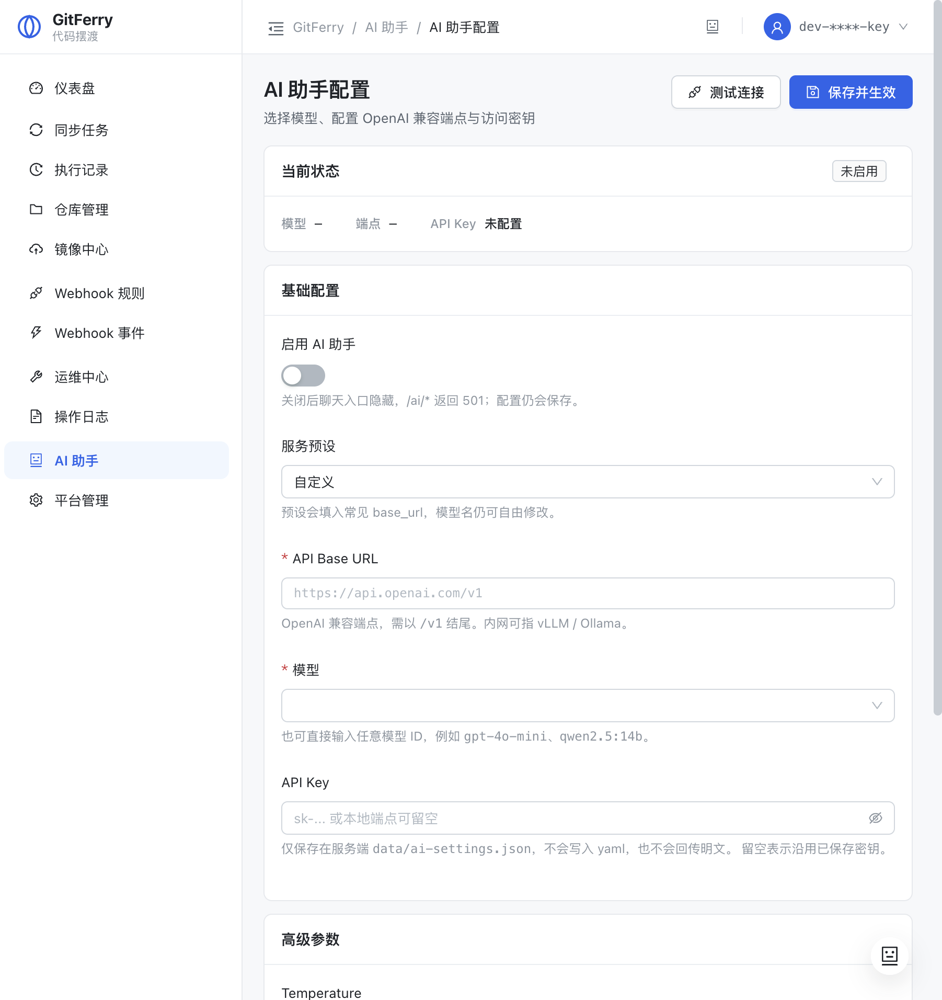

# GitFerry

> 中文名「摆渡」:把代码摆渡到该去的地方——内网之间、内网到开源世界、渡入备份港。

[](https://github.com/yi-nology/git-ferry/actions/workflows/ci.yml)
[](https://github.com/yi-nology/git-ferry/actions/workflows/release.yml)
[](https://goreportcard.com/report/github.com/yi-nology/git-ferry)
[](https://go.dev/)
[](LICENSE)
[](https://github.com/yi-nology/git-ferry/releases)

**[English](./README.md)**

[安装](#installation) · [Web 控制台](#web-控制台) · [CLI 与 Agent Skills](#cli-与-agent-skills) · [运维中心](#运维中心p0-p2) · [配置](#configuration) · [贡献](#contributing)

GitFerry 是一个自托管的 Git 仓库中枢：**跨平台同步**、**开源公开发布**（双仓/多仓 module 身份改写快照）、**仓库备份**——一站完成。自带 Vue 控制台、`gitferry` CLI 与 AI Agent Skills。

## Features

- Multi-platform Git synchronization
- Scheduled sync with cron support
- Webhook-based real-time sync
- **镜像中心:开源公开发布(双仓/多仓 module 身份改写快照,预检/编译门禁/分歧确认)与仓库备份**
- RESTful API for manual operations
- SQLite and MySQL database support
- AI 运维助手(eino):自然语言查询仓库/任务/历史/平台,危险操作需界面确认
- **Web 控制台**:中性运维台风格 UI,侧栏分组导航,仪表盘优先暴露失败任务

## Web 控制台

Vue 3 + Ant Design Vue 自托管控制台,视觉锚点为 GitHub Enterprise / Linear 式冷静运维台:
中性色优先、语义色克制、指标条替代彩色大图标。

| 入口 | 说明 |
|------|------|
| 仪表盘 | 指标条 + 失败任务「需要关注」+ 最近同步/仓库 |
| 同步任务 / 执行记录 | 任务 CRUD、筛选、批量操作、执行详情 |
| 仓库管理 / 镜像中心 | 仓库卡片、统一配置、开源发布与备份通道 |
| Webhook 规则 / 事件 | 触发规则与接收事件流 |
| 运维中心 | 健康评分、资产盘点、策略模板、部署密钥、冷备 |
| AI 助手 | 浮动球/顶栏对话;系统 → AI 助手配置模型与端点 |
| CLI / Agent | 系统 → CLI / Agent:装 gitferry、装 Skills、命令速查 |
| 平台管理 | Git 托管平台凭据与连接测试 |




更多截图见 [`docs/screenshots/`](docs/screenshots/)。前端开发说明见 [`frontend/README.md`](frontend/README.md)。

## 运维中心(P0-P2)

借鉴 gickup / ghorg / Renovate / Port Scorecards 的成熟做法,壳层内建:

| 能力 | 入口 |
|------|------|
| Prometheus 指标 | `GET /metrics` |
| 失败补偿 | `runwatch` 轮询 + 自动重跑;`POST /api/v1/ops/retry` / `retry-batch` |
| 通知矩阵 | ntfy / gotify 推送 + success/fail 分路 heartbeat(healthchecks.io) |
| 健康评分 | `GET /api/v1/ops/health-score`(gold/silver/bronze/basic) |
| 资产盘点 | `GET /api/v1/ops/inventory`(孤儿仓库) |
| 策略模板 | `GET/POST /api/v1/ops/templates` + preview/apply(dry-run) |
| 审计导出 | `GET /api/v1/ops/audit-report?format=csv` |
| 密钥注入 | `GIT_SYNC_TOKEN_<NAME>` 环境变量,令牌不进请求体 |
| 部署密钥 | `POST /api/v1/ops/deploy-key` 生成 Ed25519 镜像部署密钥 |
| Wiki 同步 | 任务开启 `sync_wiki`,自动推导 `.wiki.git` |
| Issues 导出 | `GET /api/v1/ops/issues-export?repo_key=` JSON/CSV |
| 通用回调 | `notify.webhook` 成功/失败分路 + HMAC 签名 |
| 冷备 Bundle | 任务开启 `git_bundle`,`sync.backup_dir` + `backup_keep` 轮转 |
| 灾备演练 | `POST /api/v1/ops/dr-drill` 恢复+fsck+refs 比对;RPO `GET /ops/rpo` |
| 完整性证明 | Merkle Root 清单 `POST /ops/backup-manifest` + verify |
| 元数据快照 | issues/PR/releases + source archive + Release 附件 + gists `POST /ops/metadata-backup` |
| 多目的地扇出 | `sync.backup_destinations`(s3/webdav/azure/local) |
| 生命周期 | 自动发现 `/ops/auto-discover`、漂移检测 `/ops/drift`、强制推送保护策略 |
| 治理 | RBAC 三角色、OIDC JWT、审计哈希链 `/ops/audit-chain/verify`、legal_hold |
| 一键重建 | `POST /api/v1/ops/rebuild` 清 workdir 全量重拉 |
| 过滤导入 | `POST /api/v1/ops/sync-platform` 排除 archived/fork、按 star/语言/glob |
| GitHub 全量归档 | `POST /api/v1/ops/migration` Migration API tar.gz |
| 部分克隆/子模块 | `sync.partial_clone`、任务 `submodules` |
| S3 冷备 | `sync.backup_s3` bundle 异地上传 |

前端入口:**侧栏 → 运维中心**。配置见 `conf/config.example.yaml` 的 `runwatch` / `notify` 段。

## AI 助手(eino)

基于 [CloudWeGo eino](https://github.com/cloudwego/eino) 的对话式运维助手,默认**关闭**,
不影响现有功能(未启用时 `/api/v1/ai/*` 返回 501,前端隐藏入口)。

### 界面配置(推荐)

侧栏 **系统 → AI 助手**:

1. 打开「启用 AI 助手」;
2. 选择服务预设(OpenAI / DashScope / DeepSeek / Ollama / vLLM / 自定义),或直接填 **API Base URL**;
3. 选择或输入 **模型**，可点 **获取模型** 从端点拉取真实列表(`gpt-4o-mini`、`qwen-plus`、`qwen2.5:14b` 等);
4. 填写 **API Key**(本地端点可留空),可先 **测试连接**;
5. **保存并生效** —— 配置写入 `data/ai-settings.json`,Runner 热重建,无需重启进程。

密钥只存服务端设置文件,接口永远只回 `has_api_key` / 脱敏值。


### 配置文件 / 环境变量

1. `conf/config.yaml` 打开 `ai` 段(`base_url` 可指向任意 OpenAI 兼容端点;
   生产内网可指向 vLLM / Ollama,如 `http://127.0.0.1:11434/v1`);
2. 设置环境变量 `GIT_SYNC_AI_API_KEY`(密钥不写入 yaml;界面保存的密钥同样可用);
3. 重启服务。`data/ai-settings.json` 存在时优先覆盖 yaml 默认值。

**能力:** 29 个工具(deep_analyze/plan_mode/记忆/权限分级/结果持久化/灾备演练):查询/健康评分/资产盘点/RPO/备份完整性/漂移检测/审计链/失败诊断/记忆(plan_mode/remember/recall)/危险操作确认 —— 仓库/分支/任务/执行历史/执行详情/平台/Webhook 规则/
系统概览等只读查询直接执行;`run_task`(立即同步)、`test_repo_connection`、
`test_platform_connection` 为危险操作,后端强制弹确认卡片并校验一次性令牌后才会执行。

**安全边界:** 只读默认;git 凭据与模型 Key 永不进入 prompt/日志;工具结果仅作为数据注入
(防 prompt 注入);不提供任何增删改与命令执行类工具。

**相关 API:**

| 方法 | 路径 | 说明 |
|------|------|------|
| GET | `/api/v1/ai/status` | 探测是否启用(501=未启用) |
| POST | `/api/v1/ai/chat` | SSE 流式对话 |
| GET | `/api/v1/ai/config` | 读配置(密钥脱敏) |
| POST | `/api/v1/ai/config` | 保存并热生效 |
| POST | `/api/v1/ai/config/test` | 探测 OpenAI 兼容端点 |

## Related repositories

本服务是三仓架构中的**公网壳**，以 Go module 版本依赖引擎库：

| Repository | Import path | Role |
|------------|-------------|------|
| [git-sync-core](https://github.com/yi-nology/git-sync-core) | `github.com/yi-nology/git-ferry-core` | Sync engine library (no HTTP)，当前 `v0.6.0` |
| **git-ferry**（本仓） | `github.com/yi-nology/git-ferry` | Public shell: hz API + Vue UI |
| [git-sync-intranet](https://github.com/yi-nology/git-sync-intranet) | `github.com/yi-nology/git-sync-intranet` | Intranet shell (gateway/SSO auth) |

单仓即可构建（`git clone` 后 `go build`），无需同级 checkout。

本地联调未发布的 core 时，可临时：

```bash
# 可选：本地 workspace，不提交 go.work
go work init . ../git-sync-core
```

### Intranet auth env

见 [git-sync-intranet](https://github.com/yi-nology/git-sync-intranet)：`INTRANET_AUTH_MODE` / `INTRANET_AUTH_USER_HEADER` / `INTRANET_AUTH_ALLOW_EMPTY`。

### Build image

```bash
make docker-build
```

## Installation

### From Release

Download the latest binary from [Releases](https://github.com/yi-nology/git-ferry/releases).

### From Source

```bash
git clone https://github.com/yi-nology/git-ferry.git
cd git-ferry
go build -o git-ferry .
make build-cli   # 另构建 gitferry CLI
```

## CLI 与 Agent Skills

参照 [gitlink-cli](https://github.com/ccfos/gitlink-cli) 的 Agent-Native 设计，本仓提供命令行入口与外部 Agent Skills。

### gitferry CLI

```bash
make build-cli
export GITFERRY_BASE_URL=http://127.0.0.1:8890
export GITFERRY_TOKEN=your-api-key        # 映射 X-API-Key

./output/gitferry auth status
./output/gitferry task +list --format json
./output/gitferry history +list --task t1 --format json
./output/gitferry ops +health --format json
./output/gitferry api GET /api/v1/system/status --format json
```

输出统一 Envelope（`{ok, data, error, meta}`）；危险操作（`task +run`、`ops +drill` 等）默认需确认，脚本用 `--yes`。

### Agent Skills

`skills/` 目录提供 Claude Code / MiMo 等 Agent 可直接安装的 Skills：

```bash
make install-skills
# 或 npx skills add ./skills -y -g
```

| Skill | 覆盖 |
|-------|------|
| `gitferry-shared` | 认证、Envelope、安全规则 |
| `gitferry-repo` / `gitferry-task` / `gitferry-history` | 仓库、任务、执行历史 |
| `gitferry-ops` / `gitferry-workflow` | 运维巡检、失败排查、灾备演练 |

设计与分步计划见 [`docs/superpowers/plans/2026-09-30-agent-native-cli-skills.md`](docs/superpowers/plans/2026-09-30-agent-native-cli-skills.md)。

## Usage

```bash
# Run the service
./git-ferry

# Or use make
make run
```

## Configuration

### Environment Variables

The following environment variables are required:

| Variable | Required | Description |
|----------|----------|-------------|
| `ENCRYPTION_KEY` | Yes | Encryption key for credential storage (AES-256-GCM). Min 1 byte; keys shorter than 32 bytes are hashed via SHA-256. |

Create a `.env` file from the example:

```bash
cp .env.example .env
# Edit .env and set ENCRYPTION_KEY
```

Generate a secure key:

```bash
openssl rand -base64 32
```

### Config File

Create a `conf/config.yaml` file with your configuration:

```yaml
server:
  host: "0.0.0.0"
  port: 8890

database:
  driver: sqlite
  dsn: "data/git_sync.db"
```

## Development

```bash
# Install dependencies
make tidy

# Run tests
make test

# Build
make build

# Lint / format / vet
make lint
make fmt
make vet

# Frontend (in frontend/, or just `make -C frontend build`)
cd frontend && npm ci && npm run build
```

## API Documentation

Once the server is running, access the API at `http://localhost:8890`.

## Contributing

见 [CONTRIBUTING.zh-CN.md](CONTRIBUTING.zh-CN.md)。简要步骤：

1. Fork 仓库
2. 创建分支（`git checkout -b feature/amazing-feature`）
3. 保持 `make test` / `make lint` 通过
4. 用模板提交 Pull Request

安全漏洞请走 [SECURITY.md](SECURITY.md) 私下披露，不要开公开 issue。

## License

MIT License，详见 [LICENSE](LICENSE)。

## Project Stats

<!-- STATS_START -->
| Metric | Value |
|--------|-------|
| Test Files | 19 |
| Total Tests | 104 |
<!-- STATS_END -->
