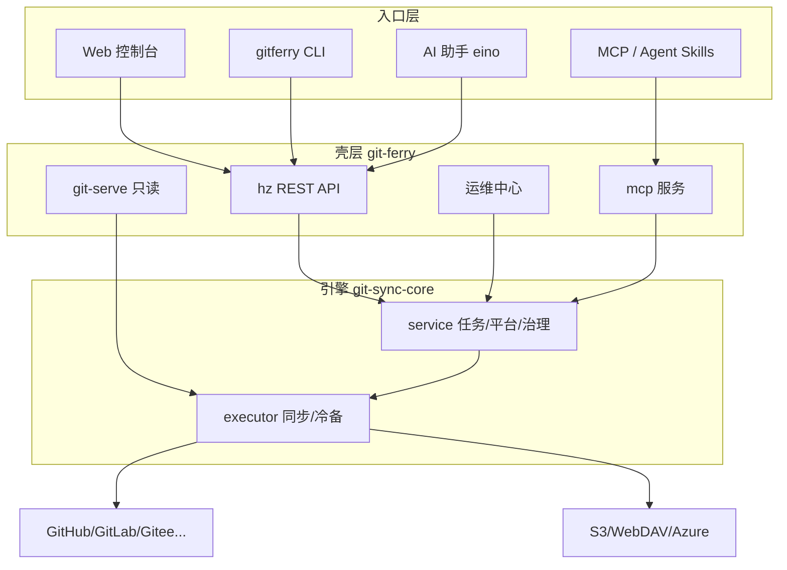

# GitFerry

> 中文名「摆渡」：把代码摆渡到该去的地方——内网之间、内网到开源世界、渡入备份港。

[](https://github.com/yi-nology/git-ferry/actions/workflows/ci.yml)
[](https://github.com/yi-nology/git-ferry/actions/workflows/release.yml)
[](https://goreportcard.com/report/github.com/yi-nology/git-ferry)
[](https://go.dev/)
[](LICENSE)
[](https://github.com/yi-nology/git-ferry/releases)
[](https://www.npmjs.com/package/gitferry-cli)

**[English](./README.md)**

[为什么是 GitFerry](#为什么是-gitferry) · [能力总览](#能力总览) · [安装 CLI](#安装-cli人类用户) · [快速上手](#快速上手人类用户) · [AI Agent 快速上手](#快速上手ai-agent) · [Web 控制台](#web-控制台) · [运维与灾备](#运维与灾备) · [Agent 接入](#agent-接入cli--mcp--skills) · [配置](#配置)

---

## 为什么是 GitFerry

代码托管平台各管一摊：GitHub 在外网、GitLab/Gitee 在内网、备份散落在脚本里。一旦要**跨平台同步**、**对外开源发布**、**冷备容灾**，往往要拼三套工具。

GitFerry 把这三件事收进一个自托管中枢：

| 场景 | 痛点 | GitFerry |
|------|------|----------|
| 跨平台同步 | 脚本 + cron + 手工对账 | 任务化同步：cron / Webhook / 手动，失败自动补偿 |
| 开源发布 | module 路径改写、双仓身份冲突 | 镜像中心：身份改写快照 + 预检/编译门禁/分歧确认 |
| 仓库备份 | 只备份 git 对象，元数据丢失 | 冷备 bundle/zip + issues/PR/releases 快照，**可恢复** |
| 运维审计 | 黑盒、无健康度 | 健康评分 / RPO / 漂移检测 / 审计哈希链 / 灾备演练 |
| 自动化接入 | 只有 Web UI | CLI + MCP + Agent Skills，人与 AI 双受众 |

对标 [gickup](https://github.com/cooperspencer/gickup) / [ghorg](https://github.com/gabrie30/ghorg) / [gitea-mirror](https://github.com/RayLabsHQ/gitea-mirror) / [github-backup-rust](https://tomtom215.github.io/github-backup-rust/) 的成熟做法，并在其上补齐「可恢复的元数据」「Agent-Native」「模块身份改写」三块差异化能力。

## 能力总览

### 同步

- 多平台：GitHub / GitLab / Gitee / GitLink / Gitea / 自建实例
- 触发：cron 表达式、Webhook 实时、手动 / 批量
- 范围：分支 glob、**include 白名单**、**忽略 `refs/pull/*` 等 PR refs**、tags、wiki、子模块、部分克隆
- 保护：`force_push_policy`（allow / block / backup_on_demand）、keep_divergent、prune
- 补偿：`runwatch` 轮询 + 自动重跑；限流自动指数退避（403/429）

### 镜像与备份

- **镜像中心**：开源公开发布（双仓/多仓 module 身份改写快照）
- **冷备**：git bundle 或 **zip** 归档，`backup_keep` 轮转，AES-256-GCM 可选加密
- **多目的地**：S3 / WebDAV / Azure / 本地目录扇出
- **元数据快照**：issues（含评论）/ PR / labels / milestones / releases / gists / Release 附件
- **元数据回灌**：`metadata-restore` 默认 dry-run，按 kinds 回写目标仓
- **完整性**：Merkle Root 清单 + 校验；灾备演练（恢复 + fsck + refs 比对）
- **Git Smart HTTP**：局域网直接 `git clone` 冷备，无需先推到另一 forge

### 生态与组织

- **Org 映射**：`preserve` / `single` / `flat` / `mixed` 批量映射到目标命名空间
- **Starred 导入**、**公共 Org 匿名镜像**（GitHub）
- **force-push 审批流**：block 策略下产生 pending，Admin 一次性放行
- **post-exec 钩子**：同步结束回调脚本（通知 / 告警 / 自定义流水线）

### 运维与治理

- 健康评分五维（reliability / freshness / schedule / safety / completeness）
- 资产盘点（孤儿仓库）、RPO/RTO、漂移检测、统一待办
- RBAC 三角色、OIDC JWT、审计导出与哈希链、legal_hold
- Prometheus 指标、ntfy/gotify/webhook 通知、成功/失败分路心跳

### 接入面

- Vue 3 Web 控制台（GitHub Enterprise / Linear 式冷静运维台）
- RESTful API + OpenAPI（`/swagger`）
- `gitferry` CLI（Envelope 输出、危险操作确认门）
- **MCP Server**（Streamable HTTP，与 AI 工具同表）
- Agent Skills（Claude Code / MiMo / Cursor）
- AI 运维助手（eino，默认关闭）

---

## 快速开始

### 前置条件

- Node.js 14+（`npm`/`npx`）— 仅 npm 安装需要
- 支持平台：macOS、Linux、Windows（x64/arm64）
- Go 1.26+ — 仅从源码构建需要
- 服务端可独立运行：Docker 或 Release 二进制

### 安装 CLI（人类用户）

> **AI 助手请注意：** 帮用户装 CLI 时请直接跳到 [快速上手（AI Agent）](#快速上手ai-agent)。

**方式 1 — npm 安装（推荐，与 [gitlink-cli](https://github.com/ccfos/gitlink-cli) 同款体验）：**

```bash
# 1) 安装 CLI（postinstall 自动下载当前平台二进制）
npm install -g gitferry-cli

# 2) 安装 Agent Skills（可选，给 Claude Code / MiMo 用）
gitferry-install-skills
# 或 npx skills add ./skills -y -g
```

**方式 2 — Release 二进制：**

```bash
# 查看 https://github.com/yi-nology/git-ferry/releases/latest 选平台包
VER=1.20.1   # 替换为最新版本
curl -fsSL -o gitferry.tgz \
  "https://github.com/yi-nology/git-ferry/releases/download/v${VER}/gitferry_${VER}_darwin_arm64.tar.gz"
tar -xzf gitferry.tgz && sudo mv gitferry /usr/local/bin/
```

**方式 3 — 源码构建 / 包管理器 / Docker：**

```bash
git clone https://github.com/yi-nology/git-ferry.git
cd git-ferry
make build && make build-cli    # output/git-ferry + output/gitferry
make docker-build               # 服务端镜像

# 包管理器模板见 examples/packaging/
# brew install yi-nology/tap/git-ferry   （tap 发布后）
```

### 快速上手（人类用户）

```bash
# 1. 配置 CLI（写入 ~/.config/gitferry/config.yaml）
gitferry config init --base-url http://127.0.0.1:8890 --token <API_KEY>
# 或环境变量：
export GITFERRY_BASE_URL=http://127.0.0.1:8890
export GITFERRY_TOKEN=<API_KEY>

# 2. 验证连通
gitferry auth status
gitferry task +list --format json

# 3. 启动服务端（若尚未运行）
cp .env.example .env && openssl rand -base64 32   # 写入 ENCRYPTION_KEY
cp conf/config.example.yaml conf/config.yaml && make run
# 打开 http://localhost:8890  （系统 → CLI / Agent 有命令速查）
```

### 快速上手（AI Agent）

> 以下步骤面向 Claude Code / MiMo / Cursor 等 Agent。需要用户在浏览器或 CI 中提供 API Key。

**第 1 步 — 安装**

```bash
npm install -g gitferry-cli
gitferry-install-skills
```

**第 2 步 — 配置**

```bash
gitferry config init --base-url http://127.0.0.1:8890 --token "$GITFERRY_TOKEN"
# 或仅环境变量（CI / 沙箱）：
export GITFERRY_BASE_URL=http://127.0.0.1:8890
export GITFERRY_TOKEN=<API_KEY>
```

**第 3 步 — 登录/验证**

```bash
gitferry auth status
gitferry ops +todo --format json
```

API Key 来源：登录 Web 控制台时使用的服务端 `GIT_SYNC_API_KEY`，或界面会话对应的密钥。

### 3 分钟跑通第一条同步

1. **平台管理** → 添加 GitHub/GitLab 凭据 → 测试连接  
2. **仓库管理** → 添加源仓与目标仓（或 `POST /ops/auto-discover` 自动发现）  
3. **同步任务** → 新建任务（可设 cron / include_branches / force_push_policy）  
4. **执行记录** → 手动触发，观察步骤与日志；失败可一键诊断 + 重试  

CLI 等价路径：

```bash
export GITFERRY_BASE_URL=http://127.0.0.1:8890
export GITFERRY_TOKEN=your-api-key

gitferry platform +list --format json
gitferry repo +list --format json
gitferry task +create --name demo \
  --source-repo gh/owner/repo --target-repo gl/owner/repo \
  --source-branch '*' --target-branch '*' --yes
gitferry task +run --key <task-key> --yes
gitferry history +list --task <task-key> --format json
```

---

## Web 控制台

Vue 3 + Ant Design Vue。视觉锚点为 **GitHub Enterprise / Linear 式冷静运维台**：中性色优先、语义色克制、指标条替代彩色大图标。

| 入口 | 说明 |
|------|------|
| 仪表盘 | 指标条 + 失败任务「需要关注」+ 最近同步/仓库 |
| 同步任务 / 执行记录 | 任务 CRUD、筛选、批量操作、执行详情 |
| 仓库管理 / 镜像中心 | 仓库卡片、统一配置、开源发布与备份通道 |
| Webhook 规则 / 事件 | 触发规则与接收事件流 |
| 运维中心 | 健康评分、资产盘点、策略模板、部署密钥、冷备与元数据回灌 |
| AI 助手 | 浮动球/顶栏对话；系统 → AI 助手配置模型与端点 |
| CLI / Agent | 系统 → CLI / Agent：装 gitferry、装 Skills、命令速查 |
| 平台管理 | Git 托管平台凭据与连接测试 |


更多截图见 [`docs/screenshots/`](docs/screenshots/)。前端开发说明见 [`frontend/README.md`](frontend/README.md)。

---

## 运维与灾备

### 能力矩阵

| 能力 | 入口 |
|------|------|
| Prometheus 指标 | `GET /metrics` |
| 失败补偿 | `runwatch` 轮询 + 自动重跑；`POST /ops/retry` / `retry-batch` |
| 通知矩阵 | ntfy / gotify 推送 + success/fail 分路 heartbeat（healthchecks.io） |
| 健康评分 | `GET /ops/health-score`（gold/silver/bronze/basic + 五维 reason） |
| 资产盘点 | `GET /ops/inventory`（孤儿仓库） |
| 统一待办 | `GET /ops/todo` + 仪表盘卡片 |
| 策略模板 | `GET/POST /ops/templates` + preview/apply（dry-run、继承链） |
| 审计 | 导出 CSV、哈希链 `GET /ops/audit-chain/verify` |
| 密钥注入 | `GIT_SYNC_TOKEN_<NAME>` / `GIT_SYNC_TOKEN_CMD_<NAME>`，令牌不进请求体 |
| 部署密钥 | `POST /ops/deploy-key` 生成 Ed25519 镜像部署密钥 |
| 冷备 | 任务 `git_bundle`；`sync.backup_format: bundle\|zip` + `backup_keep` 轮转 |
| 元数据快照 | `POST /ops/metadata-backup`（issues/PR/releases/gists/附件，支持 `since` 增量） |
| **元数据回灌** | `POST /ops/metadata-restore`（**默认 dry-run**，按 kinds 回写） |
| 灾备演练 | `POST /ops/dr-drill` 恢复+fsck+refs 比对；RPO `GET /ops/rpo` |
| 完整性证明 | Merkle Root 清单 `POST /ops/backup-manifest` + verify |
| 多目的地扇出 | `sync.backup_destinations`（s3/webdav/azure/local） |
| **Git Smart HTTP** | `git_serve` 配置段，局域网 `git clone` 冷备 |
| 生命周期 | 自动发现 `/ops/auto-discover`、漂移 `/ops/drift`、上游删仓清理 |
| **force-push 审批** | `ops/force-push-approvals` 申请 / 列表 / Admin 放行 |
| **Org 映射** | `POST /ops/org-mirror`（preserve/single/flat/mixed）+ `resolve-org-target` |
| **Starred / 公共 Org** | `POST /ops/import-starred` / `import-public-org` |
| 治理 | RBAC 三角色、OIDC JWT、legal_hold |
| 一键重建 | `POST /ops/rebuild` 清 workdir 全量重拉 |
| 过滤导入 | `POST /ops/sync-platform` 排除 archived/fork、按 star/语言/glob |
| GitHub 全量归档 | `POST /ops/migration` Migration API tar.gz |
| **post-exec 钩子** | `sync.post_exec_script`，注入 `GITFERRY_TASK/RESULT/RUN_ID/TRIGGER` |

前端入口：**侧栏 → 运维中心**。配置见 [`conf/config.example.yaml`](conf/config.example.yaml)。

### 元数据恢复闭环

备份成功 ≠ 能恢复。GitFerry 把「快照 → 校验 → 回灌」做成闭环：

```bash
# 1) 快照（可 since 增量）
curl -X POST .../api/v1/ops/metadata-backup \
  -d '{"repo_key":"gh/owner/repo","with_issues":true,"with_prs":true}'

# 2) 预览回灌计划（默认 dry-run，不写目标）
gitferry ops +metadata-restore --key gh/owner/repo --format json

# 3) 确认后真正写入
gitferry ops +metadata-restore --key gh/owner/repo --kinds labels,milestones,issues --execute --yes
```

回灌顺序：labels → milestones → issues（含评论/关闭态）→ PRs（以 issue 形态标注溯源）→ releases。

### 局域网灾备取件

```yaml
# conf/config.yaml
git_serve:
  enabled: true
  base_path: "/data/git-serve"   # 空= <sync.backup_dir>/git-serve
  public_read: false             # 仅内网才可 true
```

```bash
git clone http://gitferry:8890/git/github/octocat/hello.git
```

---

## Agent 接入（CLI · MCP · Skills）

三种接入面共用同一套工具语义，人与 AI 都能运维 GitFerry。

### 1. `gitferry` CLI

```bash
export GITFERRY_BASE_URL=http://127.0.0.1:8890
export GITFERRY_TOKEN=your-api-key        # 映射 X-API-Key

gitferry auth status
gitferry task +list --format json
gitferry ops +health --with-drift --format json
gitferry ops +metadata-restore --key gh/o/r --dry-run --format json
gitferry api GET /api/v1/system/status --format json
gitferry schema list && gitferry schema show ops
```

- 输出统一 Envelope：`{ok, data, error, meta}`；`--format json|table|yaml`
- 危险操作（`task +run`、`ops +drill`、`ops +metadata-restore --execute`）默认 409 确认，脚本用 `--yes`
- `--all` 分页拉全、`--dry-run` 批量预览、`--csv` 导出

安装方式见 [快速上手](#安装-cli人类用户)（npm 一条命令）。

### 2. MCP Server（Claude Code / Cursor）

`POST /mcp`（Streamable HTTP）与内置 AI 工具**同一注册表**，零配置接入：

```bash
# 能力探测
curl -H "X-API-Key: $GITFERRY_TOKEN" http://127.0.0.1:8890/mcp

# Claude Code
claude mcp add gitferry --transport http http://127.0.0.1:8890/mcp \
  --header "X-API-Key: $GITFERRY_TOKEN"
```

支持 `initialize` / `tools/list` / `tools/call` / `ping`。危险工具仍走确认语义。

### 3. Agent Skills

`skills/` 目录提供 Claude Code / MiMo 等可直接安装的 Skills：

```bash
make install-skills
# 或 npx skills add ./skills -y -g
```

| Skill | 覆盖 |
|-------|------|
| `gitferry-shared` | 认证、Envelope、安全规则、排障 |
| `gitferry-repo` / `gitferry-task` / `gitferry-history` | 仓库、任务、执行历史 |
| `gitferry-ops` / `gitferry-workflow` | 运维巡检、失败排查、灾备、元数据回灌 |

设计与演进计划见 [`docs/superpowers/plans/`](docs/superpowers/plans/)。

---

## AI 助手（eino）

基于 [CloudWeGo eino](https://github.com/cloudwego/eino) 的对话式运维助手，**默认关闭**（未启用时 `/api/v1/ai/*` 返回 501）。

侧栏 **系统 → AI 助手**：启用 → 选服务预设（OpenAI / DashScope / DeepSeek / Ollama / vLLM / 自定义）→ 获取模型 → 填 Key → **保存并热生效**（写 `data/ai-settings.json`，Runner 热重建）。

**能力**：30 个工具（查询 / 健康 / 资产 / RPO / 完整性 / 漂移 / 审计链 / 失败诊断 / 记忆 / plan_mode / deep_analyze / 灾备演练）。只读查询直接执行；`run_task`、连接测试等危险操作强制界面确认卡 + 一次性令牌。

**安全边界**：只读默认；git 凭据与模型 Key 永不进入 prompt/日志；工具结果仅作数据注入（防 prompt 注入）。

| 方法 | 路径 | 说明 |
|------|------|------|
| GET | `/api/v1/ai/status` | 探测是否启用（501=未启用） |
| POST | `/api/v1/ai/chat` | SSE 流式对话 |
| GET | `/api/v1/ai/config` | 读配置（密钥脱敏） |
| POST | `/api/v1/ai/config` | 保存并热生效 |
| POST | `/api/v1/ai/config/test` | 探测 OpenAI 兼容端点 |
| GET | `/api/v1/ai/models` | 拉取端点模型列表 |

---

## 配置

### 环境变量

| 变量 | 必填 | 说明 |
|------|------|------|
| `ENCRYPTION_KEY` | 是 | 凭据存储 AES-256-GCM 密钥（&lt;32 字节会经 SHA-256 派生） |
| `GITFERRY_TOKEN` | CLI | `gitferry` CLI 的 API Key（`X-API-Key`） |
| `GIT_SYNC_AI_API_KEY` | AI | AI 助手 API Key（可选） |
| `GIT_SYNC_TOKEN_<NAME>` | 运维 | 平台令牌注入，不进请求体/配置 |
| `GIT_SYNC_TOKEN_CMD_<NAME>` | 运维 | 从 secrets manager 取令牌的命令 |
| `GIT_SYNC_BACKUP_DIR` | 冷备 | 冷备输出目录 |
| `GIT_SYNC_POST_EXEC_SCRIPT` | 钩子 | 同步后置脚本路径 |

```bash
cp .env.example .env
openssl rand -base64 32   # 写入 ENCRYPTION_KEY
```

### 配置文件

`conf/config.yaml`（完整示例见 [`conf/config.example.yaml`](conf/config.example.yaml)；Schema 见 [`conf/config.schema.json`](conf/config.schema.json)）：

```yaml
server:
  host: "0.0.0.0"
  port: 8890
  api_key: ""              # X-API-Key；生产必填强随机值
  api_key_role: admin      # admin | operator | readonly

database:
  driver: sqlite           # sqlite | mysql
  dsn: "data/git_sync.db"

sync:
  backup_dir: "var/backup"
  backup_keep: 5           # 每任务保留最近 N 份
  backup_format: bundle    # bundle | zip
  post_exec_script: ""     # 同步结束回调
  max_concurrent: 2

runwatch:
  interval_seconds: 30
  history_limit: 10
  retry:
    max_auto_retries: 2
    cooldown_minutes: 5

# notify:
#   ntfy: [{ url: "https://ntfy.sh", topic: "gitferry-alerts" }]
#   gotify: [{ url: "https://gotify.example.com", token: "..." }]
#   heartbeat:
#     success_urls: ["https://hc-ping.com/uuid"]
#     fail_urls: ["https://hc-ping.com/uuid"]

# git_serve:
#   enabled: false
#   base_path: ""          # 空= <sync.backup_dir>/git-serve
#   public_read: false     # true 仅限内网
```

---

## 相关仓库

本服务是三仓架构中的**公网壳**，以 Go module 版本依赖引擎库：

| Repository | Import path | Role |
|------------|-------------|------|
| [git-sync-core](https://github.com/yi-nology/git-sync-core) | `github.com/yi-nology/git-ferry-core` | 同步引擎库（无 HTTP） |
| **git-ferry**（本仓） | `github.com/yi-nology/git-ferry` | 公网壳：hz API + Vue + CLI |
| [git-sync-intranet](https://github.com/yi-nology/git-sync-intranet) | `github.com/yi-nology/git-sync-intranet` | 内网壳（网关/SSO 鉴权） |

单仓即可构建（`git clone` 后 `go build`）。本地联调未发布 core：

```bash
go work init . ../git-sync-core   # 勿提交 go.work / replace
```

### 架构示意



---

## 开发

```bash
make tidy && make test && make lint
make build && make build-cli
make apidoc          # 重新生成 docs/openapi.json
cd frontend && npm ci && npm run build
```

- 架构说明：[ARCHITECTURE.md](ARCHITECTURE.md)
- 贡献指南：[CONTRIBUTING.zh-CN.md](CONTRIBUTING.zh-CN.md)
- 对标开源差距规划：[docs/superpowers/plans/2026-10-01-competitor-gap-roadmap.md](docs/superpowers/plans/2026-10-01-competitor-gap-roadmap.md)
- 竞品调研证据：[designs/research/git-backup-mirror-findings.md](designs/research/git-backup-mirror-findings.md)

无服务轻量路径（CI 定时镜像）见 [`examples/ci/github-actions-mirror.yml`](examples/ci/github-actions-mirror.yml)。

## 安全

漏洞请走 [SECURITY.md](SECURITY.md) 私下披露，不要开公开 issue。凭据 AES-256-GCM 加密存储；令牌仅经环境变量/密钥命令注入；危险操作默认需确认。

## 贡献

1. Fork 仓库
2. 创建分支（`git checkout -b feature/amazing-feature`）
3. 保持 `make test` / `make lint` 通过
4. 用模板提交 Pull Request

## License

MIT License，详见 [LICENSE](LICENSE)。

## Project Stats

<!-- STATS_START -->
| Metric | Value |
|--------|-------|
| Test Files | 19 |
| Total Tests | 104 |
<!-- STATS_END -->
