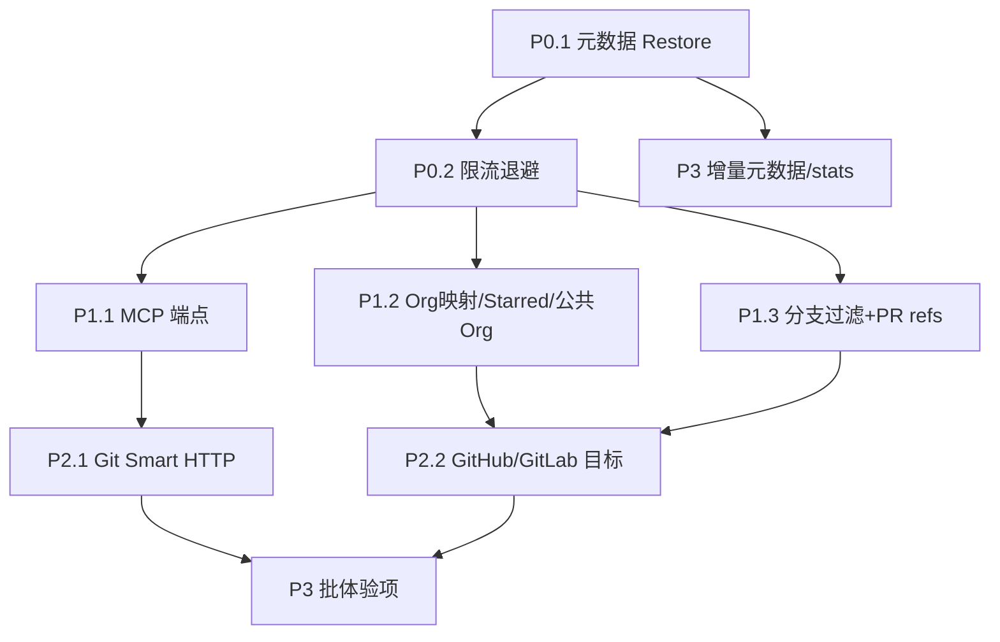

# 对标开源缺口 — P0–P3 分批实施规划

> 依据：`designs/research/git-backup-mirror-findings.md`（2026-10 全网复扫）
> 对标：ghorg / gickup / gitea-mirror / github-backup-rust / forks / gitlink-cli
> 日期：2026-10-01
> 依赖：`git-ferry-core` 同步引擎；壳层 `biz/handler` + `idl` + `internal/*` + `frontend`

## 0. 总览

| 批次 | 主题 | 闭环 | 估量 |
|------|------|------|------|
| **P0** | 恢复与韧性 | 元数据可回灌、限流退避可见 | 3–5 天 |
| **P1** | 生态接入 | MCP、org 映射、分支过滤、starred | 4–6 天 |
| **P2** | 形态与分发 | Git Smart HTTP、GitHub/GitLab 目标、安装包 | 5–7 天 |
| **P3** | 体验与工程 | hooks、增量元数据、zip、CI 模板、首启向导 | 3–5 天 |

**不做（明确出界）**：P2P 网状同步、Renovate/Scorecard 整包、多租户 SaaS 控制面、冷门源端大跃进。

---

## 1. P0 — 恢复与韧性（先做）

### 1.1 元数据 Restore（对标 rust `github-backup` / `gitea-mirror`）

**现状**：`POST /ops/metadata-backup` 快照 issues(+评论)/PR/labels/milestones/releases/gists 到
`backup_dir/metadata/<repo_key>/<ts>/`；`bundles/restore` 只恢复 git 对象。DR 演练不验元数据。

**目标**：快照可回灌到「同仓或指定目标仓」；DR drill 可选抽样比对 issue 数/label 集合。

#### API

| 方法 | 路径 | 权限 | 说明 |
|------|------|------|------|
| POST | `/api/v1/ops/metadata-restore` | Admin | 执行回灌 |
| GET | `/api/v1/ops/metadata-restore/history` | 读 | 回灌记录 |
| POST | `/api/v1/ops/dr-drill`（扩展） | Write | `with_metadata=true` 时抽样校验 |

```thrift
// idl/ops.thrift 追加
struct MetadataRestoreReq {
  1: string repoKey (api.json="repo_key")
  2: string snapshotDir (api.json="snapshot_dir")   // 空则取最新快照
  3: optional string targetPlatform (api.json="target_platform") // 空则原平台
  4: optional string targetOwner (api.json="target_owner")
  5: optional string targetRepo (api.json="target_repo")
  6: list<string> kinds (api.json="kinds")          // labels,milestones,issues,prs,releases
  7: bool dryRun (api.json="dry_run")               // 默认 true
  8: bool overwrite (api.json="overwrite")          // 同名 label/milestone 是否覆盖
}
struct MetadataRestoreResult {
  1: string snapshotDir
  2: string target            // host/owner/repo
  3: map<string, RestoreKindStat> stats  // kind → {planned,created,skipped,failed}
  4: list<string> warnings
  5: bool dryRun
}
```

#### 落点

| 层 | 路径 |
|----|------|
| IDL | `idl/ops.thrift` → `biz/model/ops/ops.go` |
| Handler | `biz/handler/git_sync/metadata_restore.go`（新建） |
| 路由 | `biz/router/custom.go` ops 组 + AdminGuard |
| 回灌引擎 | `internal/githubapi/restore.go`：labels → milestones → issues → PR-as-issue → releases |
| 快照读取 | 复用 `metadata_service.go` 的目录布局与 JSON 形状 |
| DR 演练 | `dr_service.go`：`with_metadata` 抽样 `len(issues)` / label 名集合 |
| AI 工具 | `internal/agent/tools/backup_dr.go`：`restore_metadata`（危险，确认卡） |
| CLI | `gitferry ops +metadata-restore --dry-run` / `--yes` |
| 前端 | 运维中心「冷备」页签：快照行 → 「回灌」按钮（dry-run 预览 → 确认） |

#### 回灌顺序与安全

1. **labels**（无依赖，可覆盖开关）
2. **milestones**（按 title 去重，due_on 保留）
3. **issues**（按 `number`/title+created 去重；body 注入原链接溯源）
4. **PRs 以 issue 形态回灌**（body 头部标注 `<!-- gitferry-restore:pr -->`；不创建真实 PR，除非 `kinds` 含 `prs` 且目标 API 支持）
5. **releases**（仅 tag+name+body；assets 默认跳过，`with_assets` 再传）

约束：
- dry-run 只读快照 + 目标 API 探测，**不写**
- 默认 `overwrite=false`，同名跳过并记 `skipped`
- 凭据走既有 `platform` token；日志与 Envelope **永不打印 token**
- 单次 `max_items` 与 backup 一致（默认 500 / 上限 2000）

#### 验收

```bash
go test ./biz/handler/git_sync/ -run MetadataRestore -count=1
# 手工：backup → 改目标仓 → restore --dry-run → restore → issues 数一致
gitferry ops +metadata-restore --repo-key r1 --dry-run --format json
```

---

### 1.2 平台 API 限流退避可见化（对标 gickup / rust backup）

**现状**：`sync.rate_limit: 100` 是 **webhook IP 限流**，不是 GitHub API secondary rate limit。
`githubapi` 调用失败即失败，历史里看不到「因限流退避」。

**目标**：统一 `internal/githubapi` 调用层：

| 能力 | 做法 |
|------|------|
| 识别 403/429 + `Retry-After` / `X-RateLimit-Remaining=0` | 封装 `do()` |
| 指数退避 | 1s → 2s → 4s → … 上限 60s，最多 5 次 |
| 记录 | `SyncRun.Steps[]` 增加 `rate_limited=true`、`backoff_ms`、`reason` |
| 指标 | `gitferry_api_ratelimit_total{platform,endpoint}` |
| 通知 | 连续退避 ≥3 次写入 run 日志，不打断任务（除非最终失败） |

落点：`internal/githubapi/client.go`（或新建 `throttle.go`）、`corebridge` 历史步骤写入。

#### 验收

- 单测：mock 403 + Retry-After → 重试成功；耗时与次数断言
- `GET /ops/diagnose` 输出含 `rate_limited` 线索
- `/metrics` 出现 ratelimit counter

---

### 1.3 P0 回归清单

| 项 | 命令 / 检查 |
|----|-------------|
| 单测 | `go test ./... -count=1` |
| 元数据往返 | backup → restore dry-run → restore（实验仓） |
| 演练 | `POST /ops/dr-drill` with_metadata=true |
| CLI | `ops +metadata-restore --yes` 门禁 |
| 密钥 | 日志 grep 无 token |

---

## 2. P1 — 生态接入

### 2.1 MCP Server 端点（对标 `cicbyte/forks`）

**现状**：eino 30 工具在进程内；外部 Agent 走 HTTP CLI + Skills。

**目标**：`POST /mcp`（Streamable HTTP）暴露同语义只读/危险工具，与 `internal/agent/tools` **同一注册表**，避免双份漂移。

| 项 | 设计 |
|----|------|
| 协议 | MCP Streamable HTTP（JSON-RPC）；`GET /mcp` SSE 可选 |
| 鉴权 | `Authorization: Bearer <API-Key>` 或 `X-API-Key`（同 CLI） |
| 工具面 | 只读查询全量；写操作仅 `run_task` 等既有危险集 + 409 确认（MCP `elicitation` 或返回 `needs_confirm`） |
| 实现 | `internal/mcp/`：tools adapter → 复用 `agent/tools` 的 `Tool` 定义 |
| 路由 | `r.POST("/mcp", ...)`、`r.GET("/mcp", ...)`；swagger 另注 |
| 配置 | `mcp.enabled` 默认 false；`mcp.path` 默认 `/mcp` |
| 文档 | README「MCP」节 + Skills 中交叉引用 |

**不改** eino 内嵌路径；MCP 与 Skills 并行。

#### 验收

- `claude mcp add` / Cursor 配置后 `list_repos` 可用
- 危险工具无确认不执行
- `go test ./internal/mcp/`

---

### 2.2 Org 映射策略 + Starred + 公共 Org（对标 gitea-mirror）

#### 2.2.1 Org 映射策略

任务或「批量导入」级字段：

```
org_mapping: preserve | single | flat | mixed
target_org: string          # single/mixed 时的落点
```

| 策略 | 行为 |
|------|------|
| preserve | `src_owner/repo` → `dst_owner/repo` |
| single | 全部 → `target_org/repo` |
| flat | 全部 → `target_user/repo`（个人命名空间） |
| mixed | 个人仓→flat；组织仓→preserve 到对应 org |

落点：`idl/sync_task.thrift` 或 `repo`/`import` API；`corebridge` 建仓/推送 URL 改写；前端批量导入向导。

#### 2.2.2 Starred 仓库

- `POST /ops/import-starred`（Write）：拉取平台 starred → 可选建任务
- 过滤：`exclude_archived` / `min_stars` 复用 import_filter

#### 2.2.3 公共 Org 匿名镜像

- `POST /ops/import-public-org`：`{provider, instance_url, org}` → 匿名列仓 → 建只读任务
- 降级说明：GitHub 匿名 60 req/h；文档写明

#### 验收

- 四策略各建一任务，目标路径符合表
- starred 导入列表可勾选
- 公共 org 无 token 可镜像 public 仓

---

### 2.3 分支过滤 + 忽略 PR refs（对标 Forgejo / git-sync-mirror）

`SyncTask` / `CreateTaskReq` 增加：

```
include_branches: list<string>   # glob，空=全部
exclude_ref_patterns: list<string>  # 默认 ["refs/pull/*", "refs/merge-requests/*"]
```

- 推送前 filter refs；`git_push_prune` 仅 prune 范围内 refs
- 前端任务表单：分支白名单 tag 输入 + 「忽略 PR refs」默认开

落点：`idl/sync_task.thrift`、core 推送路径、`biz/handler/git_sync/sync_task_service.go`、前端 `CreateTask` 表单。

#### 验收

- 仅 `main,release/*` 时目标仓无 feature 分支
- 目标无 `refs/pull/*` 垃圾 ref

---

### 2.4 P1 其它（小项，跟批走）

| 项 | 说明 |
|----|------|
| 上游删仓清理 | `POST /ops/cleanup-deleted`：对比平台列表与本地，标记/删任务（Admin + dry-run） |
| force-push **审批流** | `force_push_policy=block` 时产生 pending 审批（`ops/force-push-approvals`），Admin 一次性放行 |
| metrics 按任务标签 | `gitferry_sync_runs_total{task,platform,result}` 补齐 |

---

## 3. P2 — 形态与分发

### 3.1 Git Smart HTTP 只读服务（对标 forks / backhub）

**目标**：局域网/灾备时 `git clone http://gitferry:8890/git/<host>/<owner>/<repo>.git` 直接取本地 mirror/bundle 解包产物。

| 项 | 设计 |
|----|------|
| 路由 | `GET/POST /git/*repoPath`（git http-backend 语义） |
| 存储 | 指向 `sync.workdir` 下 bare mirror；无则 404 |
| 鉴权 | `mcp` 同款 token **或** 可配置 `git_serve.public_read=true`（仅内网） |
| 实现 | `git http-backend` 子进程或 go-git 只读；推荐 `exec git http-backend`（成熟） |
| 配置 | `git_serve.enabled` / `base_path` / `public_read` |

CLI 辅助：`gitferry ops +git-url --repo-key r1` 打印 clone URL。

#### 验收

- `git clone` 成功且 `git fsck` 干净
- 未开 `public_read` 时无 token 401

---

### 3.2 推到 GitHub / GitLab 备份目标（对标 gitea-mirror PUSH_TARGETS）

- 目标类型扩展：`backup_destinations` 增加 `github` / `gitlab`（remote push）
- 语义：保持 bare/mirror，force 按 `force_push_policy`
- 与「镜像中心开源发布」区分：此路径 **不改写 module 身份**，纯备份副本

落点：`internal/corebridge` destination 抽象；`conf` `sync.backup_destinations`。

---

### 3.3 分发面

| 包 | 动作 |
|----|------|
| Homebrew tap | `yi-nology/homebrew-tap` + goreleaser `brews` |
| Scoop | goreleaser `scoops` |
| Nix module | 参考 gitea-mirror：flake + `nixosModules` |
| Proxmox LXC | 可选：community-scripts 风格一键脚本 |

---

### 3.4 源/目标广度（按需）

优先级：**Bitbucket Server > Gogs > OneDev > SourceHut > Opengist > Radicle**。
每端一评：API 能力矩阵 + 是否值得。不承诺本季全上。

---

## 4. P3 — 体验与工程

| 项 | 设计要点 | 落点 |
|----|----------|------|
| post-exec hook | `sync.post_exec_script`：成功/失败退出码注入 env（`GITFERRY_TASK`/`GITFERRY_RESULT`） | corebridge 后置钩子 |
| 增量元数据 | `metadata-backup?since=ISO8601` / `--since` | `metadata_service.go` |
| zip + keep | 本地备份格式 `zip` 选项 + `backup_keep` 轮转 | `sync.backup_format: bundle\|zip` |
| 配置 JSON Schema | 发布 `config.schema.json`，IDE 校验 `conf/config.yaml` | `conf/` + docs |
| CI 模板包 | `examples/ci/github-actions-mirror.yml` 等：无服务轻路径 | `examples/ci/` |
| 首启向导 | 无平台时仪表盘引导：加平台 → 测连接 → 发现仓 → 建任务 | frontend |
| Web 文件浏览 | 只读浏览 workdir bare 的 tree/blob（救援） | `GET /api/v1/ops/repo-files` |
| stats 趋势 | `GET /ops/trends?days=30` 成功率/耗时时间序列 | 新 handler + 前端小图 |
| credential helper | git 凭证不进 argv：`GIT_ASKPASS` 临时脚本或 credential helper | core 同步路径 |
| 多映射配置 | `conf/sync_maps[]` 一文件多 source→dest（服务模式用任务表即可，CLI 批量可加） | CLI/YAML |

---

## 5. 里程碑与依赖



**建议排期**（单人全职近似）：

| 周 | 内容 |
|----|------|
| W1 | P0.1 元数据 restore（API+回灌+dry-run+CLI） |
| W2 | P0.2 限流 + P0 回归 + P1.3 分支过滤 |
| W3 | P1.1 MCP + P1.2 org/starred |
| W4 | P2.1 Git HTTP + P2.2 备份目标 |
| W5 | P2.3 分发 + P3 小项扫尾 |

---

## 6. 验收总表（发版门）

| 批次 | 门禁 |
|------|------|
| P0 | `go test ./...`；metadata 往返；DR with_metadata；无密钥泄漏 |
| P1 | MCP 客户端连通；四策略路径正确；PR refs 不出现 |
| P2 | `git clone` 从 GitFerry 成功；Homebrew 安装；github destination 同步成功 |
| P3 | hook 被调用；`since` 增量；schema 校验；首启向导可走通 |

统一回归：

```bash
go test ./... -count=1
go vet ./...
cd frontend && ./node_modules/.bin/vue-tsc -b && npm run build
make build && make build-cli
```

---

## 7. 风险与取舍

| 风险 | 缓解 |
|------|------|
| 元数据 restore 写平台 API 易违规 | 默认 dry-run；Admin；overwrite 显式；限速 |
| MCP 与 eino 工具双份 | **同一 tools 注册表**，adapter 只做协议壳 |
| Git Smart HTTP 暴露内部仓 | 默认关；`public_read` 显式；仅 bind 内网 |
| core 与壳版本漂移 | 任务字段变更走 core 发版；壳 `require` 新版本 |
| 范围膨胀 | 每批单独 PR/发版；P3 可裁剪 |

---

## 8. 本计划与调研的映射

| 调研缺口 | 批次 |
|----------|------|
| 元数据 restore | P0.1 |
| 限流退避 | P0.2 |
| MCP | P1.1 |
| org 映射 / starred / 公共 org | P1.2 |
| 分支过滤 / PR refs | P1.3 |
| 上游删仓 / force 审批 / metrics 标签 | P1.4 |
| Git Smart HTTP | P2.1 |
| GitHub/GitLab 目标 | P2.2 |
| Homebrew/Scoop/Nix | P2.3 |
| 源端广度 | P2.4 |
| hook / since / zip / schema / CI / 向导 / 浏览 / trends / credential / 多映射 | P3 |

---

相关文档：
- `designs/research/git-backup-mirror-findings.md` — 竞品证据
- `docs/superpowers/plans/2026-09-30-agent-native-cli-skills.md` — CLI/Skills 已落地
- `docs/superpowers/plans/2026-09-30-acceptance-checklist.md` — 发版回归
